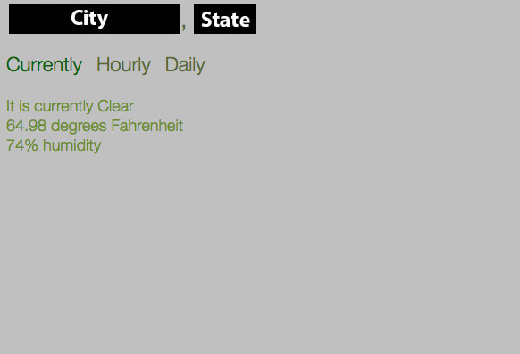
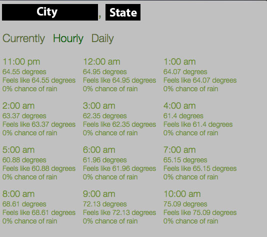
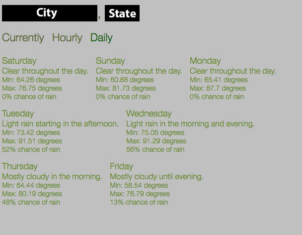

##Weather Menu Application
This is a project where I'm pretty much just messing around with electon.js to build a desktop application that interacts with a weather api to display the weather in the menu bar.

####Project Details
I used the Forecast weather api with a node js wrapper along with a google maps api that is used to get your current location. You will need an API key for both of these.

You can installing the correct dependencies (forecast and menubar) using 
```
npm install --save dependency_name
```

After navigate to your project folder in the terminal run the following to start the application.
```
./node_modules/.bin/electron .
```

Don't forget to insert your own API keys into the code!

##Todo
1. Add custom location functionality
2. Add color customization functionality (maybe)
3. Fix issues detailed for project
4. Package for consumer usage

##Images
(Blacked out my location for obvious reasons)
####Current Weather

####Hourly Weather

####Daily Weather
